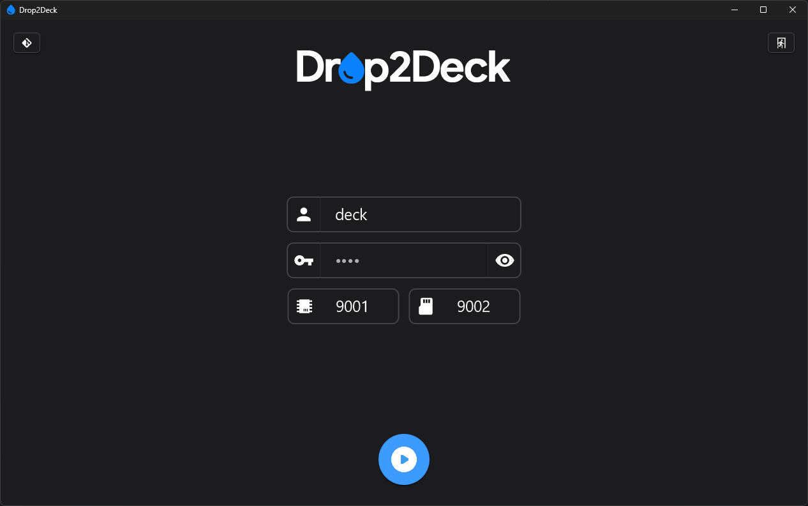
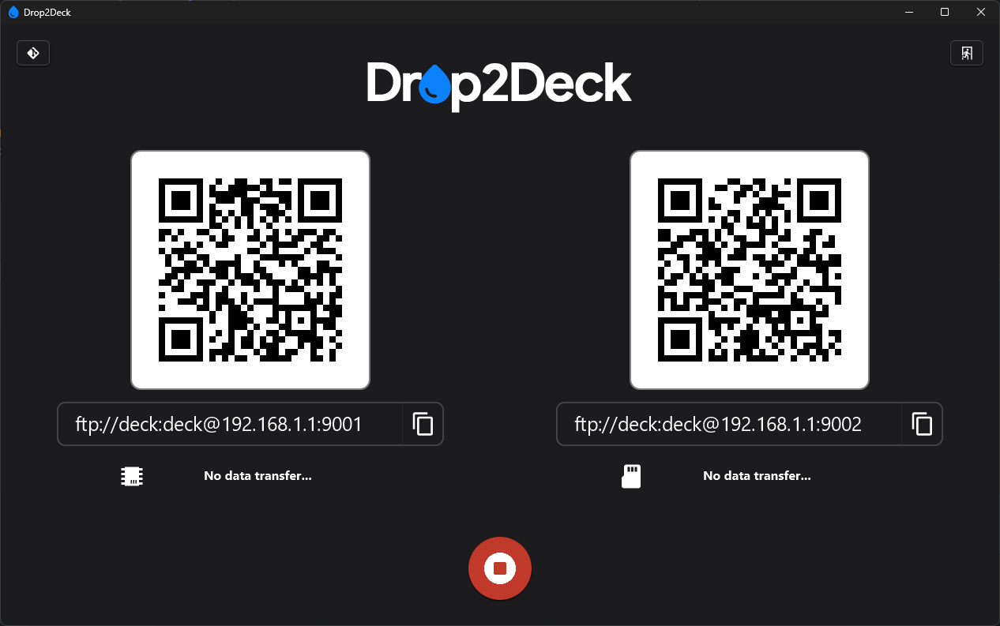

<p align="center">
  
</p>

# Drop2Deck

Q: *How the heck I can send files to my Steam Deck easily without headache?*  
A: *Drop2Deck!*

<p align="center">
  
</p>

### What it this?

Very simple cross-platform `Java + JavaFX` application that creates `FTP servers` for both `Internal memory` and `MicroSD card` of your `Steam Deck`

App can be used on `Windows`, `Linux` and `MacOS`, but designed with `Steam Deck` and `SteamOS` in mind. Also, it can be used on any `Windows` handhelds (eg, `AyaNeo`, `Asus ROG Ally`, etc.)

You even can add app into `Gaming Mode` on your `Steam Deck` and transfer files without moving into `Desktop mode`!

### Prerequisites

*Note: `binary` version of app will work only on `x86_64` systems! `JAR` version works everywhere*

#### Windows

Install [Microsoft Visual C++ 2010 (x64)](https://www.microsoft.com/en-US/download/details.aspx?id=26999) and [Microsoft Visual C++ 2015 (x64)](https://www.microsoft.com/en-US/download/details.aspx?id=53840)

#### Linux/MacOS

Additional libs are not required, but make sure to mark file as executable before use

### How to install and launch

Just download latest binary file for your system from [Release](https://github.com/CrazyXacker/Drop2Deck/releases) section, put it in desired location and launch as normal app. After that you will see app UI

### How to configure

App UI is very simple and consist of few configuration fields and `Start`/`Stop` button

*Note: default settings with `deck` username, `deck` password and `9001`/`9002` ports should be fine for almost all users*

Fields:  
`Username`: define `username` that you will use to connect  
`Password`: define `password` that you will use to connect  
`Port (Internal memory)`: define internal memory `port` that you will use to connect  
`Port (External memory)`: define external memory `port` that you will use to connect

### How to start

Just hit `Start` button

### How to connect

Select `FTP Client` that will be used for connection to `Deck2Drop`. I prefer `FileZilla`. Open client and type info from app: `IP`, `Username`, `Password` and `Port`. Hit `Connect` and you will see files and folders on your device. Start working with them as with regular file manager

*Note: `Deck2Drop` starts 2 separate servers for `Internal` and `External` memory on separate ports*

### Notes

#### Predefined paths

Paths for supported systems are predefined:  
**Steam Deck**: `/home` and `/run/media/mmcblk0p1`  
**Windows**: `C:\` and `D:\`  
**Linux**: `/home` and `/mnt`  
**MacOS**: `/Users` and `/Volumes`  

#### Hidden files and directories

Hidden files and directories may be invisible in `FTP Client`, but you can always move to desired folder by name. For example: `/home/deck/.steam`

#### FTP Server IP

App will always select first Network interface with *lower IP*, get local `IP` and show it in UI. For example: `192.168.1.1`. In some cases, it may be not your actual `IP`. In that cases, check it with `ipconfig` commang on `Windows` and `ifconfig` on `Linux`

#### FTP Users

If you change `FTP Username` and want to delete old user, you will need to delete `users.properties` file that stored in app directory

#### Build for MacOS

App is cross-platform and can be launched in `MacOS` on regular `JDK 17+` with `JavaFX 20 SDK`, but it is designed to work as `Native app` that can be produced with `GraalVM Native image`. That neat feature requires some configuration before use  

There is no that configuration and build for `MacOS`. But you can make it. Refer to `GraalVM Native Image` docs for info

## Building

`Drop2Deck` is plain `Java` app that uses `JavaFX` for UI. If you want to build or develop app, clone this repo, make sure to rename `gradle.properties.example` into `gradle.properties`, fill `GraalVM` paths on it and open project in desired IDE or terminal

### Build JAR file

Execute ```gradlew shadowJar``` task. This task will produce `fat` jar that can be launched with any `JRE/JDK 17+` with no additional dependencies

*Note: is designed to work as `Native app` without any installed `JRE/JDK`*

### Build GraalVM Native Image

### Prerequisites

Install latest [GraalVM JDK 17](https://www.graalvm.org/downloads/) for your system

#### Windows

Follow [Windows instructions](https://www.graalvm.org/latest/docs/getting-started/windows/)

#### Linux

Follow [Linux instructions](https://www.graalvm.org/latest/docs/getting-started/linux/)

### Building

#### Windows

Execute ```gradlew nativeBuild``` task. After success, binary file will be in `\build\gluonfx\x86_64-windows` folder

#### Linux

Rename `buildLinux.sh.example` into `buildLinux.sh` and fill required fields. Head into project dir and execute it. After success, binary file will be in `/build/gluonfx/x86_64-linux` folder
